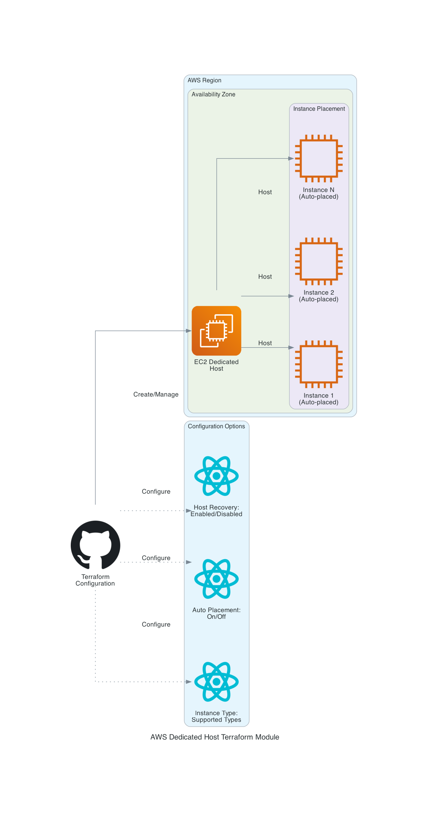

# AWS EC2 Dedicated Host Terraform Module

This Terraform module creates an AWS EC2 Dedicated Host resource with support for all available configuration options.

## Architecture



## Features

- Creates an EC2 Dedicated Host
- Supports host recovery configuration
- Configurable auto placement options
- Support for tagging
- Complete example configuration
- Comprehensive test coverage

## Usage

```hcl
module "dedicated_host" {
  source = "github.com/thomasvincent/terraform-aws-dedicated-host-"

  name              = "my-dedicated-host"
  availability_zone = "us-west-2a"
  instance_type     = "c5.large"
  auto_placement    = "on"
  host_recovery     = "on"

  tags = {
    Environment = "production"
    Project     = "my-project"
  }
}
```

## Requirements

| Name | Version |
|------|---------|
| terraform | >= 1.0.0 |
| aws | >= 4.0 |

## Providers

| Name | Version |
|------|---------|
| aws | >= 4.0 |

## Resources

| Name | Type |
|------|------|
| [aws_ec2_host.this](https://registry.terraform.io/providers/hashicorp/aws/latest/docs/resources/ec2_host) | resource |

## Inputs

| Name | Description | Type | Default | Required |
|------|-------------|------|---------|:--------:|
| name | Name for the dedicated host | `string` | n/a | yes |
| availability_zone | The availability zone of the Dedicated Host | `string` | n/a | yes |
| instance_type | The instance type to support on this host | `string` | n/a | yes |
| auto_placement | Indicates whether the host accepts any untargeted instance launches that match its instance type configuration (on \| off) | `string` | `"on"` | no |
| host_recovery | Indicates whether to enable or disable host recovery for the Dedicated Host (on \| off) | `string` | `"off"` | no |
| instance_family | The instance family supported by this dedicated host | `string` | `null` | no |
| outpost_arn | The ARN of the AWS Outpost on which to allocate the Dedicated Host | `string` | `null` | no |
| tags | A map of tags to add to all resources | `map(string)` | `{}` | no |

## Outputs

| Name | Description |
|------|-------------|
| id | The ID of the Dedicated Host |
| arn | The ARN of the Dedicated Host |
| availability_zone | The availability zone of the Dedicated Host |
| owner_id | The ID of the AWS account that owns the Dedicated Host |
| tags_all | A map of tags assigned to the resource, including those inherited from the provider |

## Testing

The module includes a test suite using Terratest and Docker for reproducible testing.

```bash
# Run tests using Docker
make docker-test

# Run linting and validation
make

# Format code
make fmt
```

## License

This module is licensed under the MIT License - see the LICENSE file for details.